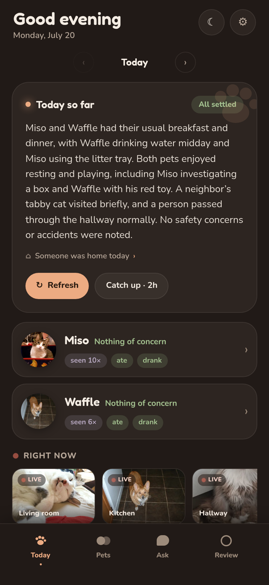
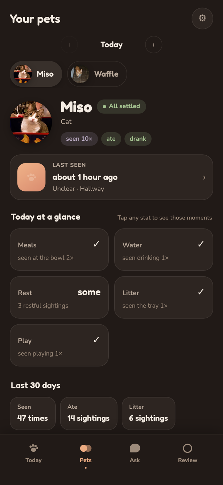
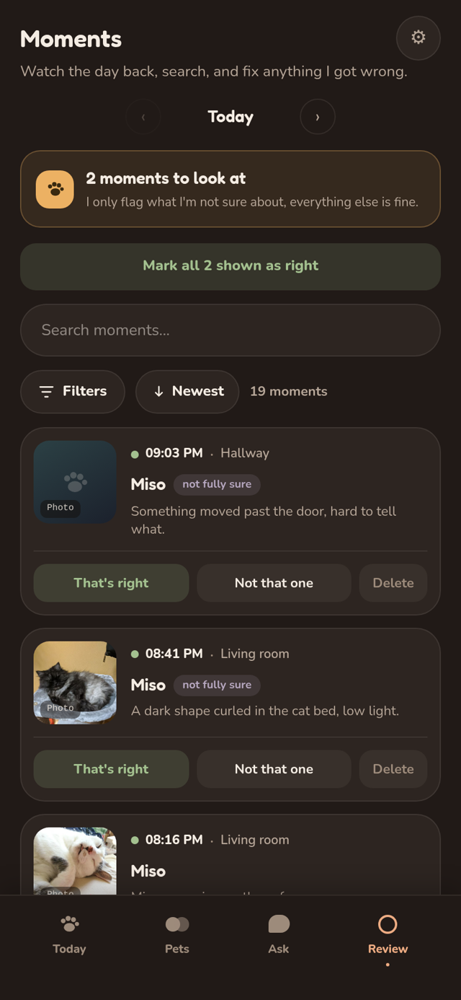
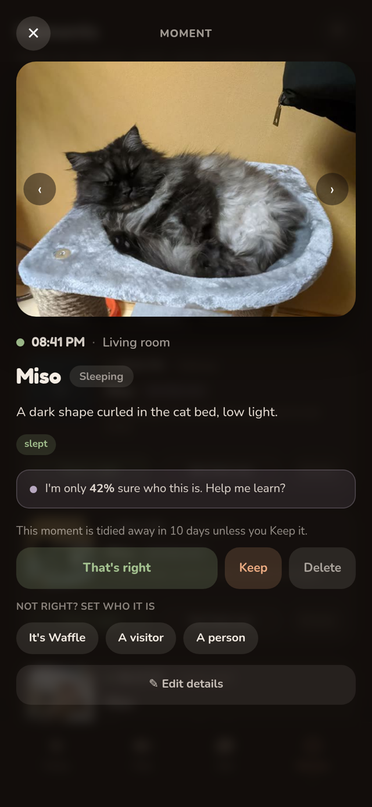
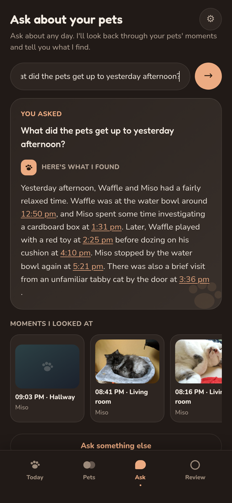
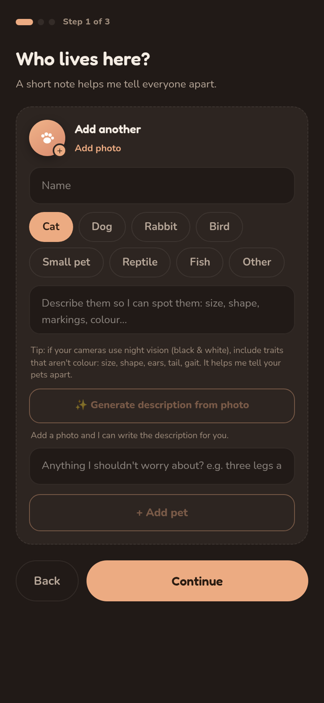
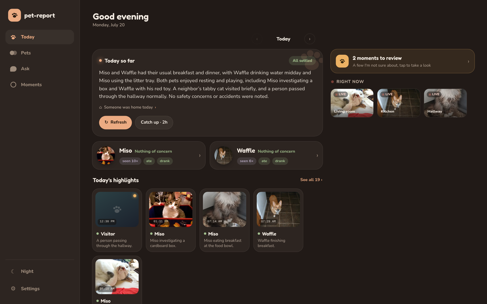

# pet-report

**A self-hosted daily journal of how your pets are doing while you're out, written by a vision model that runs on your own hardware.**

I have a cat and a dog, and whenever I travel I worry about them. A pet sitter
helps, but a sitter only catches the obvious: an empty bowl, a litter tray that
needs changing. The subtle things slip past. My cameras aren't much better. They
ping me when they spot a pet, I tap the notification, and I get a clip of a cat
wandering across the kitchen. It's something, but it's bland, and it can't even
tell me which pet it saw.

Is my cat eating properly and drinking enough water? Are they sleeping all day
because something's off, or just because that's what cats and dogs do? Is one of
them moping by the door, out of their routine in a way I should worry about?
That's the stuff a motion clip will never tell you, however many of them you
scroll through. So I built pet-report to answer those questions instead.

<p align="center">
  
  
  
</p>
<p align="center">
  
  
  
</p>
<p align="center">
  
</p>

*The screenshots show a demo household. The pet photos come from
[cataas.com](https://cataas.com) and [dog.ceo](https://dog.ceo); point it at
your own cameras and it fills with your animals instead.*

## What it is

pet-report sits on top of [Frigate](https://frigate.video/), the NVR I already
run to bring all my pet cameras together and tune the object detection on my home
server. Frigate is good at spotting that something happened; pet-report works out
what it means.

It's a harness around a local vision and language model. You tell it about your
household: who each pet is and how to tell them apart, what your routine looks
like, and which parts of their day you care about, meals, water, sleep, zoomies,
litter trips, whatever matters to you. All of that shapes what it asks the model
and how it writes the day up, so what comes back is about your animals and the
routine you actually keep.

The model runs on your own machine. Mine lives on the same home server as
Frigate. Your cameras, your footage, and everything pet-report learns about your
pets stay on your network.

## How it works

```
  cameras ─▶ Frigate ─▶ pet-report ─▶ SQLite ─▶ web app
                            │  ▲
                            ▼  │   "what is this, and what's it doing?"
                        vision model
```

1. Frigate watches your cameras and flags pets and sounds.
2. Twice a day, pet-report works through the new flags. It sends each frame (and
   its clip) to the vision model, stores what comes back as structured per-pet
   observations, writes the day's summary, and updates the stats.
3. Between Frigate's events it also grabs a frame from each camera every few
   minutes, so quiet stretches aren't left blank.
4. The web app shows the day, the pets, and the moments.

## What you get

Once setup is done and the first batch has run (you can trigger one by hand),
the first thing you see is the day written out: a short account of what your pets
did and whether anything looked off. Below it, the timeline, every sighting in
order.

You don't have to take its word for it. Every event carries its own proof: the
model's description sits next to the clip it came from, so you can check it
against the footage yourself. When it gets something wrong, you fix it. The
correction is stored next to the model's original reading, so nothing is lost and
you can revert, and the stats and the written summary are rebuilt from your
version. None of this trains anything. A correction fixes the record, and the
model behaves the same way on the next run.

The rest of it:

- **A daily summary** you can read at a glance and page back through, day by
  day.
- **A browsable timeline** of every moment, each with the clip that backs it up,
  filterable by pet, room, activity, or time of day.
- **Stats and habits, per pet:** how much they're eating and drinking, when and
  where they sleep, favourite rooms, how active they've been, and a heads-up when
  something drifts from their usual, like eating less or sleeping more.
- **Questions in plain language.** Ask "did the dog drink today?" and it answers
  from what the cameras saw, shows you the moments it used as proof, and tells you
  when it can't tell.
- **Keepsakes.** Save the good ones, a proper zoomies session, a nap in a sunbeam,
  so they outlast the camera footage they came from.

## A note on how it was built

Most of the code here was written by an AI coding assistant, with me directing
and reviewing the work. A polished app this size isn't something I'd have
finished on my own in my spare time. I'd have lost interest long before it did
anything useful. With this being said AI contributions are welcome and I will
strive to review them manually.

## What you need

- **[Frigate](https://frigate.video/)** (0.16+; 0.17+ for speech transcription)
  already watching your cameras. pet-report reads its events, snapshots, clips,
  and audio labels. It never talks to the cameras directly.
- **A local vision model** behind any OpenAI-compatible endpoint. In practice, a
  machine with enough GPU (or patience) to run a vision-capable model under
  [llama-swap](https://github.com/mostlygeek/llama-swap), llama.cpp, or similar.
  The model name is whatever your server calls it.

## Choosing a vision model

pet-report talks to any OpenAI-compatible vision (multimodal) endpoint, so the
model is your call. It's a hard job: read a dim, cluttered frame, tell a cat from
a dog, and say what it's doing. Bigger models get it right more often. Smaller
ones are faster and lighter on memory, at the cost of more mistakes. The app is
built to absorb the misses, so starting small is reasonable. Uncertain moments
get flagged for review either way.

Two things set the ceiling: how much GPU memory you have, and how long you'll
wait. Analysis runs as a twice-daily batch rather than live, so slow is tolerable
and CPU-only works if you're patient.

A sensible setup is a quantized GGUF build under llama.cpp or llama-swap, the
largest that fits your VRAM with room to spare for the image.

The client is written to llama.cpp's OpenAI-compatible extensions: JSON-schema
`response_format` for structured extraction, `reasoning_content` for the thinking
trace, and `chat_template_kwargs`. A backend that speaks those (llama.cpp, or
llama-swap in front of it) is the tested path. A strictly vanilla OpenAI endpoint
may ignore them.

## Get it running

### NixOS (recommended)

The flake exposes `nixosModules.pet-report` and `overlays.default`:

```nix
{
  inputs.pet-report.url = "github:bolt12/pet-report";  # or your fork's URL

  # in your host config:
  nixpkgs.overlays = [ pet-report.overlays.default ];
  imports = [ pet-report.nixosModules.pet-report ];

  services.pet-report = {
    enable = true;
    port = 8115;                      # public nginx port for the UI
    frigateUrl = "http://localhost:8114";
    llamaUrl = "http://localhost:8080";
    visionModel = "your-model-name";   # exactly as your model server names it
    ntfyUrl = "https://ntfy.sh/your-unguessable-topic";   # where the pushes go
    # publicUrl = "http://nas.lan:8115";                  # makes a push tappable
    # basicAuthFile = "/run/secrets/pet-report-htpasswd";  # optional gate
  };
}
```

The module runs the single `serve` service, builds the frontend, and configures
nginx to serve it and proxy `/api` and `/proof` to the backend. It captures
frames every 10 minutes and batches at 08:00 and 20:00 from background loops of
that one process (tune with `PET_REPORT_CAPTURE_SECS` and
`PET_REPORT_BATCH_HOURS`). First visit opens the guided setup: name your pets,
describe how to tell them apart (or attach a photo and let it draft the
description), pick cameras auto-discovered from Frigate, and test the
connections.

### Docker

A single image runs just pet-report: the `serve` process (the API plus the
capture and batch loops) behind nginx, which serves the built UI and proxies
`/api` and `/proof` to it. It does not bundle Frigate or the model server; point
it at the ones you already run.

Building it needs nothing but Docker:

```sh
docker build -t pet-report .
```

That compiles the backend and its whole dependency set from source, which is the
slow part: about three minutes on a 32-core machine, and since GHC parallelises
well, a good deal longer on a four-core box. Give Docker a few GB of RAM for it.
Later builds reuse the cached dependency layer, so a code change rebuilds in
under a minute. The result is around 620 MB.

If you already have Nix, `nix build .#docker && docker load < result` produces
the same container without the compile. The two are separate builds of the same
thing, so either is fine.

Frigate and the model server run outside the container, so give the container a
route to them. `--add-host host.docker.internal:host-gateway` maps that name to
the host, so `http://host.docker.internal:PORT` reaches a service listening on
the host:

```sh
docker run -d --name pet-report \
  -p 8115:8115 \
  -v pet-report-data:/data \
  --add-host host.docker.internal:host-gateway \
  -e FRIGATE_URL=http://host.docker.internal:8114 \
  -e LLAMA_SWAP_URL=http://host.docker.internal:8080 \
  -e VISION_MODEL=your-vision-model \
  -e PET_REPORT_TZ=Europe/Lisbon \
  pet-report:latest
```

The UI is then at `http://localhost:8115` and first visit opens the guided
setup. All state (the SQLite database, queued and proof frames, kept media)
lives in the `/data` volume; back that up and pet-report survives a container
rebuild.

If Frigate and the model run in other containers, put them on a shared Docker
network and use their service names and internal ports instead of
`host.docker.internal` (e.g. `FRIGATE_URL=http://frigate:5000`), then drop the
`--add-host` line.

The environment variables are the ones in [Configuration](#configuration) below
(and `.env.example`). The image defaults the data paths under `/data` and serves
the UI on `8115`; leave `PET_REPORT_LISTEN` at its default so the backend stays
on loopback behind the image's nginx. `PET_REPORT_PUBLIC_URL` is optional.
`NTFY_URL` has a working default rather than an off switch, so set it to your own
topic or expect a logged push failure after each batch.

There is no login here either, same as every other way of running it. Keep the
container on a trusted network, or put an authenticating reverse proxy in front
of it (see [Network and access](#network-and-access)).

### Manual

To run it directly on the host, without Nix or a container, you wire up the same
three pieces yourself:

1. **Backend.** Build with GHC 9.10 / cabal (`cabal build`), or grab the binary
   out of `nix build .#backend` if you have Nix but not NixOS. Export the
   environment you need (see `.env.example`; the defaults put state in
   `~/.local/share/pet-report`) and run `pet-report serve` under systemd, runit,
   or whatever keeps your processes alive.
2. **Frontend.** `cd frontend && npm install && npm run build` produces a static
   `dist/`.
3. **Web server.** Serve `dist/` and proxy `/api` and `/proof` to the backend's
   listen address (default `127.0.0.1:8116`). Any reverse proxy works; nginx is
   what the NixOS module generates.

### Development

```sh
# backend, from backend/ (the dev shell brings ghc, cabal, HLS, formatters)
nix develop
cabal build all
cabal test all --test-show-details=direct
cabal run pet-report -- serve   # reads the env; see .env.example

# frontend, from frontend/
npm install
npm run dev             # Vite dev server, proxies /api to the backend
npm run check           # svelte-check
npm run build           # production build to dist/
```

`nix flake check` runs the full backend build and test suite.

[`CONTRIBUTING.md`](CONTRIBUTING.md) has the orientation: the layout, what the
dev shell gives you, and what has to pass before a PR.

## Configuration

The backend reads infrastructure settings from environment variables (the NixOS
module sets them). The pet roster, report preferences, and household context are
app state, set during in-app setup, not config. See `.env.example` for a copyable
list.

| Variable | Default | Purpose |
| --- | --- | --- |
| `PET_REPORT_LISTEN` | `127.0.0.1:8116` | `host:port` the API serves on |
| `FRIGATE_URL` | `http://localhost:8114` | Frigate base URL (cameras auto-discovered) |
| `LLAMA_SWAP_URL` | `http://localhost:8080` | OpenAI-compatible vision model base URL |
| `VISION_MODEL` | `vision-model` | model name to request, as your server names it (the default is a placeholder) |
| `PET_REPORT_TZ` | `UTC` | IANA zone for day boundaries |
| `NTFY_URL` | `http://localhost:8106/pet-report` | ntfy topic URL for the morning/evening push notifications |
| `PET_REPORT_PUBLIC_URL` | (unset) | public web UI URL; the tap-through target for push notifications |
| `PET_CAMERAS` | `office` | fallback camera list (the profile supersedes it) |
| `PET_LABELS` | `dog,cat` | Frigate object labels ingested as pet sightings |
| `PET_AUDIO_LABELS` | `bark,meow,doorbell,…` | Frigate audio labels ingested as sound events |
| `PET_REPORT_DB` | XDG data dir | SQLite database path |
| `PET_REPORT_QUEUE` | XDG data dir `/queue` | periodic-frame queue directory |
| `PET_REPORT_PROOF_DIR` | XDG data dir `/proof` | retained proof-frame directory |
| `PET_REPORT_MEDIA_DIR` | XDG data dir `/media` | owned copies of kept moments' media and pet photos |
| `PET_REPORT_RETENTION_POLL_SECS` | `900` | how often to re-read Frigate's clip retention for the countdown |
| `PET_REPORT_CAPTURE_SECS` | `600` | how often the capture loop queues a frame per online camera |
| `PET_REPORT_BATCH_HOURS` | `8,20` | local hours the batch (analysis, report, cleanup) runs |
| `PET_REPORT_LOG_LEVEL` | `info` | minimum severity logged: `debug`, `info`, `warn`, `error` |

The Frigate/model URLs, model name, timezone, enabled cameras, and the
keep-moments window are all editable in-app. A saved profile overrides the
matching env default with no restart.

Everything else in the table is environment-only and read once at startup.

### Notifications

When a batch writes a report, pet-report pushes it to
[ntfy](https://ntfy.sh/). The body is the day's summary under the title "Pet
report", sent at ntfy priority 3, or priority 4 with a warning tag when something
in the day reads as concerning. One push per report, so two on a normal day. Set
`PET_REPORT_PUBLIC_URL` as well and the notification becomes tappable, opening
the web UI.

`NTFY_URL` is the whole topic URL rather than a server address, so the last path
segment is the topic you subscribe to in the ntfy app. The default,
`http://localhost:8106/pet-report`, means a self-hosted ntfy on port 8106 and a
topic named `pet-report`. On hosted ntfy it is `https://ntfy.sh/<topic>` instead.

Choose an unguessable topic if the server is public. Anyone who knows an ntfy.sh
topic name can read it, and these messages describe what happens in your house
and when nobody is home, so `pet-report` or `dogs` will eventually be read by
strangers. Add enough random characters that nobody guesses it.

There is no in-app setting for any of this and no value that turns notifications
off. Leaving `NTFY_URL` unset means the default above, which the batch will try
and fail to reach twice a day, logging `[WARN] [ntfy] push failed` each time.
Point it at a topic you run, or ignore the warning.

### Sound and speech

Sound events and speech both come from Frigate rather than from the cameras
directly, and both stay off until you enable them in your Frigate config.

A bark, the doorbell, a smoke alarm: those come from Frigate's audio detector, so
turn audio on for the cameras you care about.

```yaml
audio:
  enabled: true
  listen: [speech]        # plus bark, meow, etc. as you like
```

Which of those labels pet-report ingests is set by `PET_AUDIO_LABELS` above, and
the default covers the usual dog and cat noises plus doorbells, alarms, and
breaking glass. When Frigate also recorded the moment, its clip carries the audio
and the moment plays back in the app. When it didn't, the moment is marked "sound
only".

Frigate 0.17+ can transcribe a recorded event with a local model:

```yaml
audio_transcription:
  enabled: true
  model_size: small       # sherpa-onnx; use 'large' for the whisper model
  language: en
```

With that on, the per-moment "Transcribe speech" button calls Frigate's
transcribe API and caches what comes back, so a given moment is only transcribed
once. It runs one event at a time and only for events Frigate recorded, so a
moment with no recording behind it has nothing to transcribe and stays "sound
only".

## Limitations

Worth knowing before you commit an afternoon to setting it up:

- It is only as good as your model and your camera placement. A small local VLM
  misreads scenes: it will sometimes describe the wrong species, miss a pet in
  shadow, or invent an activity. The app is built around that, so uncertain
  moments are flagged for review and everything is correctable.
- Identification is species-level. The model sees "a cat" or "a dog", not a name.
  pet-report puts a name to a sighting only when exactly one active pet has that
  species, so with one cat and one dog every sighting is labelled for you. With
  two cats, each cat sighting stays "a cat" until you pick the individual in the
  timeline. There is no face recognition or re-identification model behind this,
  and naming one sighting does not name the next.
- Stats are sighting-based: counts and proportions of what the cameras saw, never
  invented durations. Cameras that are off contribute nothing.
- Eating, drinking and litter use are hard to see. A zero there means "not seen",
  not "did not happen", and the app's language keeps that distinction.
- It is not a vet. The wellbeing read is a convenience laid over what the cameras
  happened to catch, not a medical assessment. If a pet seems off, trust your own
  eyes and call your vet; don't wait for the app to flag it, and don't read a calm
  summary as the all-clear.

## Storage and cleanup

pet-report keeps two kinds of thing, and they last for different lengths of time.

The record is small and permanent: the day's written summary and the per-pet
stats. It sits in a SQLite database on your machine, and the app never deletes it
on its own. An old day keeps its summary and its numbers indefinitely.

The moments are the bulky part, the stills and clips behind each sighting. The
video belongs to Frigate and only lasts as long as Frigate keeps it, so every
un-kept moment shows a countdown. It is removed at whichever comes first: the
keep-window you set in pet-report (Settings -> "How long to keep moments", 30 days
by default), or Frigate's own retention for that camera.

Keeping a moment copies the still and clip into pet-report's own storage, so they
survive after Frigate has pruned the original. Kept moments never expire and show
no countdown.

Old days shrink rather than disappearing. When a day passes your keep-window, the
batch first saves that day's stats, then clears out its un-kept stills and clips.
What's left is the summary, the numbers, and anything you kept, not a wall of
empty entries.

Removing a pet hides it; deleting erases it. "Remove" archives a pet, so it stops
being identified and drops off the Pets screen, but its history stays and old days
still show it. "Delete for good" in Manage data is the only thing that erases a
pet's history.

Deleting anything in pet-report only affects pet-report. It never touches Frigate.

## Network and access

The app trusts its network. The backend listens on loopback and nginx is the only
exposure; there is no login and no per-request authentication. Run it on a LAN or
behind a VPN (a WireGuard interface works well). Do not port-forward it to the open
internet.

## Support and license

pet-report is a personal project, shared in the hope it is useful. It is
maintained as time allows, on no schedule and with no support guarantee. "It
works on my cameras" is the baseline. The issue tracker is still the right place
for bugs, and a clear report (what you saw, what you expected, your model and
Frigate versions) will usually get a reply.

Copyright (C) 2026 Armando Santos.

pet-report is free software under the [GNU AGPL-3.0-or-later](LICENSE): you can
run, study, share, and modify it. The obligation that matters here is the network
one: if you run a modified version as a service for others, you must offer those
users the complete source of your version. That keeps pet-report and its forks
open, including against anyone who would otherwise host it as a closed service.
